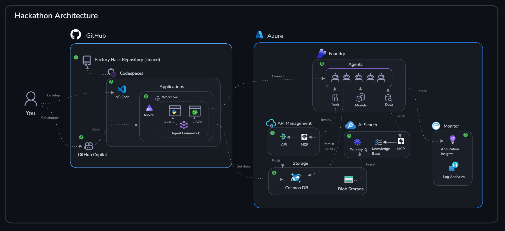

# Intelligent Predictive Maintenance Hackathon

Welcome to the Intelligent Predictive Maintenance Hackathon. In this workshop you’ll explore how AI agents can support predictive maintenance in a tire manufacturing setting—focused on practical patterns you can adapt to real environments.

## Introduction

In this hackathon you’ll explore how agent workflows can support predictive maintenance: faster triage, more consistent diagnosis, and smoother handoffs from detection to repair planning.

Using the **Microsoft Agent Framework**, **Microsoft Foundry** and **Azure**, you’ll build a small multi-agent workflow that mirrors a real maintenance process: monitoring telemetry, identifying anomalies, performing fault diagnosis, planning repairs, and proposing a schedule. The goal is a clear, observable workflow that can be reasoned about, tested, and iterated on.

## Learning Objectives

By participating in this hackathon, you will learn how to:

- Implement five focused agents (Anomaly Detection, Fault Diagnosis, Repair Planner, Scheduler, Orderer) and connect them to data/tools
- Use GitHub Copilot (including a custom **agentplanning** coding agent) to accelerate development while keeping changes reviewable
- Add persistent agent memory (threads) and apply it to maintenance scenarios where history matters
- Instrument the solution so you can inspect agent outputs, tool calls, logs, and traces during development
- Build an end-to-end agent workflow using Microsoft Agent Framework and sequential orchestration hosted in **Aspire** with agent-to-agent (A2A) communication.

## Scenario

This hackathon uses a fictitious tire manufacturing company as an example, but the scenario is applicable to most manufacturing environments where machines are involved in production.

The image below illustrates the conceptual scenario.

1. The factory operates a production line made up of multiple specialized machines, each responsible for a distinct step in tire manufacturing (e.g., mixing, extrusion, curing, inspection).
2. A key business metric is **Overall Equipment Effectiveness (OEE)**—how effectively equipment is utilized during planned production time. Unplanned downtime and quality losses directly reduce throughput and profitability.
3. Maintenance technicians perform both **planned** (time/usage-based) maintenance and **condition-based** maintenance triggered by sensor readings and detected anomalies. Because machines are complex, tasks require specific skills, certifications, and safety procedures.
4. Spare parts are held in a local warehouse with limited stock. When inventory falls below thresholds or parts are needed for a repair, replenishment is coordinated with external suppliers, often with lead times and ordering constraints.
5. The production environment integrates with multiple core systems (e.g., WMS/ERP/CMMS/MES/QMS/knowledge bases). These systems coordinate production, maintenance execution, inventory, quality, and scheduling—making end-to-end orchestration essential.

The maintenance process is complex and requires coordination across people, parts, and systems. Common challenges include:

- Detecting when a machine needs attention, who should be notified, and how to prioritize the response.
- Diagnosing the root cause of irregular machine behavior using telemetry plus shared knowledge and historical patterns.
- Determining which parts are required, whether they are in local stock, and how to handle supplier lead times.
- Matching work to technicians with the right skills, certifications, and safety requirements.
- Scheduling technicians based on availability, shifts, and constraints (e.g., access windows, downtime limits).
- Finding the optimal maintenance window that minimizes production disruption while keeping risk acceptable.

Agents can help by coordinating data, decisions, and handoffs across these steps. The intent is not to “replace” technicians or planners, but to reduce time-to-triage and make the workflow more consistent and observable.

The image below shows the agent roles used in this hackathon and how they interact with telemetry and existing factory systems.

1. Telemetry is emitted from machine sensors and evaluated for deviations (for example, simple thresholds or an anomaly detection model).
2. The **Anomaly Classification Agent** classifies the situation (e.g., normal/warning/critical), enriches it with machine context, and raises an alert with an appropriate priority.
3. The **Fault Diagnosis Agent** proposes likely root causes using telemetry plus documented historical knowledge (runbooks, prior work orders, technician notes).
4. The **Repair Planner Agent** translates diagnosis into an actionable repair plan: required parts, estimated effort, and required skills/certifications. It can draft a work order for review.
5. The **Maintenance Scheduler Agent** proposes a maintenance window based on priority/risk, technician availability, and production constraints.
6. The **Parts Ordering Agent** checks inventory and suggests replenishment orders based on supplier lead times and constraints.

The factory process spans many systems, teams, and areas of responsibility. Agents closer to analytics might be built by one team, while agents tied to day-to-day operations might be built and operated by another. Teams also vary in skills, tooling, and language preferences. This hackathon embraces that reality: we keep agents independent, but designed to collaborate through well-defined inputs/outputs and shared observability.

## Architecture

In this hackathon you’ll build multiple agent applications (Python and .NET) and connect them using a sequential workflow in the **Microsoft Agent Framework**. The workflow itself is described in the scenario section above; the focus here is the supporting platform components.

The image below illustrates the reference architecture used throughout the hackathon.

1. The documentation, starter code, and sample assets are available in this GitHub repository. You will fork it to your own GitHub account and work from your fork.
2. **GitHub Codespaces** will provide a containerized development environment with the required tools and extensions pre-installed, so everyone starts from a known baseline.
3. You will build individual agent applications (mostly in Python, with some in .NET) and eventually run the end-to-end workflow locally using **Aspire**. Aspire will also give you a single place to start the system and inspect service logs.
4. **GitHub Copilot** will be used to co-develop parts of the solution—one of the exercises uses it to build an agent from scratch—and you can use it throughout the hackathon for implementation, refactoring, and troubleshooting. The goal is to accelerate development while keeping changes understandable.
5. Agents will be registered in **Microsoft Foundry** and configured with the selected model deployments plus the tools and data connections they need.
6. **API Management** will act as an AI gateway for selected endpoints. When needed, agents will access those APIs via **MCP**, which provides a consistent interface for tool calling.
7. **Foundry IQ / knowledge sources** will provide content for retrieval-augmented generation (RAG), such as machine documentation, troubleshooting guides, and historical notes.
8. Factory data (machines, thresholds, inventory, work orders, etc.) will be stored in **Cosmos DB** and **Blob Storage** and used by agents during analysis and planning.
9. **Application Insights** (and related logs/traces) will provide observability across the workflow so you can troubleshoot agent behavior, tool calls, and end-to-end requests.

> [!NOTE]
>Manufacturing environments are complex: legacy systems, safety requirements, strict uptime targets, and processes that exist for good reasons—often split across distributed teams and both IT and OT domains.
>
>This hackathon uses a deliberately simplified lab setup so you can focus on the learning objectives and the core patterns of agentic development (workflow design, tool integration, and observability), rather than the full complexity of factory networking, governance, and infrastructure.

## Challenges

- **Challenge 0**: **[Environment Setup & Data Foundation](challenge-0/README.md)** : Set up your development environment, deploy Azure resources, configure environment variables, and seed sample factory data with 5 machines including pre-seeded warning conditions.
- **Challenge 1**: **[Anomaly Detection and Fault Diagnosis Agents](challenge-1/README.md)**: Build an agent that monitors IoT telemetry from tire manufacturing equipment, compares readings against thresholds, and detects anomalies using threshold-based logic
- **Challenge 2**: **[Repair Planner Apigent and AI-Driven Development](challenge-2/README.md)**: Learn agent-driven development with GitHub Copilot by using the @agentplanning agent to guide you through building a Repair Planner Agent in .NET
- **Challenge 3**: **[Predictive Maintenance & Parts Ordering Agents with Memory](challenge-3/README.md)**: Build Predictive Maintenance and Parts Ordering agents using Microsoft Foundry's persistent memory layer to maintain context across sessions
- **Challenge 4**: **[Multi-Agent Orchestration](challenge-4/README.md)**: Create the workflow of these 5 agents using Microsoft Agent Framework and run it in **Aspire**

## Requirements

To successfully complete this hackathon, you will need the following:

- GitHub account to access the repository and run GitHub Codespaces and use Github Copilot
- Be familiar with Python or .NET programming, including handling JSON data and making API calls
- Be familiar with Generative AI Solutions and Azure Services
- An active Azure subscription, with Owner rights
- Ability to provision resources in **Sweden Central** or [another supported region](https://learn.microsoft.com/en-us/azure/ai-foundry/openai/concepts/models?tabs=global-standard%2Cstandard-chat-completions#global-standard-model-availability)

## Contributing

This project welcomes contributions and suggestions.  Most contributions require you to agree to a
Contributor License Agreement (CLA) declaring that you have the right to, and actually do, grant us
the rights to use your contribution. For details, visit [Contributor License Agreements](https://cla.opensource.microsoft.com).

When you submit a pull request, a CLA bot will automatically determine whether you need to provide
a CLA and decorate the PR appropriately (e.g., status check, comment). Simply follow the instructions
provided by the bot. You will only need to do this once across all repos using our CLA.

This project has adopted the [Microsoft Open Source Code of Conduct](https://opensource.microsoft.com/codeofconduct/).
For more information see the [Code of Conduct FAQ](https://opensource.microsoft.com/codeofconduct/faq/) or
contact [opencode@microsoft.com](mailto:opencode@microsoft.com) with any additional questions or comments.

## Trademarks

This project may contain trademarks or logos for projects, products, or services. Authorized use of Microsoft
trademarks or logos is subject to and must follow
[Microsoft's Trademark & Brand Guidelines](https://www.microsoft.com/legal/intellectualproperty/trademarks/usage/general).
Use of Microsoft trademarks or logos in modified versions of this project must not cause confusion or imply Microsoft sponsorship.
Any use of third-party trademarks or logos are subject to those third-party's policies.