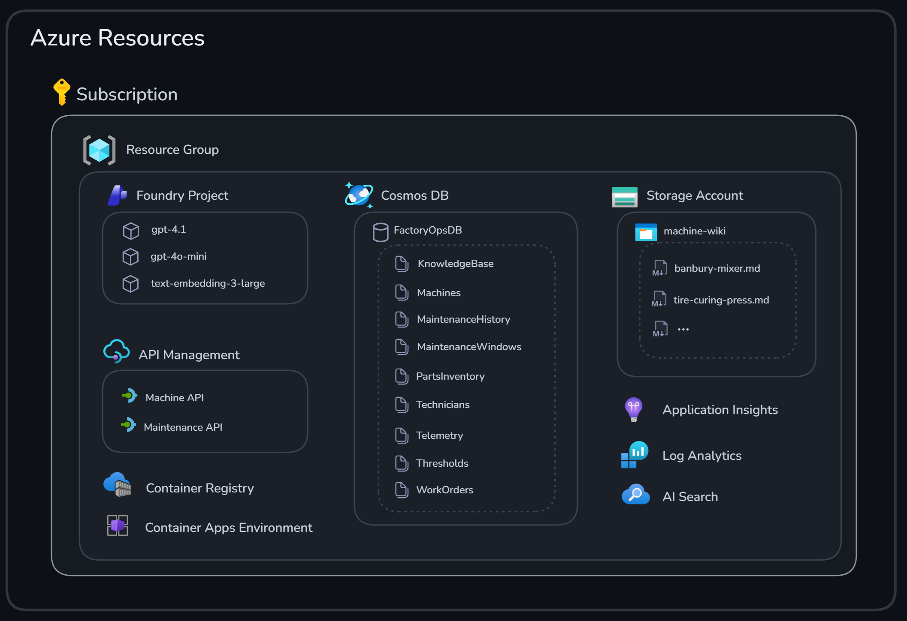

# Challenge 0: Environment Setup

Welcome to your very first challenge! In this challenge, we’ll set the foundation for the hackathon. You’ll deploy the required Azure resources, set up your development environment, and prepare the assets needed for the next challenges. By the end, you’ll have everything ready for the rest of the hackathon.

If something isn’t working as expected, please let your coach know.

**Expected duration**: 45-60 min

**Prerequisites**:

- **Azure Subscription** with permissions to create resources
- **GitHub Account** to fork the repository
- **GitHub Codespaces** access
- **Azure CLI** (pre-installed in Codespaces)

## 🎯 Objective

The goals for this challenge are:

- Provision the Azure resources needed for the upcoming challenges.
- Seed sample data for the tire factory predictive maintenance multi-agent system.

## 🧭 Context and Background

A number of different Azure Resources are used as part of this hackathon.

The following image illustrates the setup:





All resources reside in a single resource group.

- A **Foundry Account** with a **Foundry Project** with model deployments for **gpt-4.1**, **gpt-4o-mini** and **text-embedding-ada-002**
- **API Management** with two API proxies that read data from **Cosmos DB**
- **Cosmos DB** with a database including data for machines, technicians, work orders, and more
- **Storage Account** with knowledge base wiki articles in Markdown
- **Application Insights** and **Log Analytics** for logging
- **AI Search** to query wiki data
- **Container Registry** and **Container Apps Environment** for running containers

Sample data is seeded into different **Cosmos DB** containers that will be queried during the exercises.
<details>
<summary>Cosmos DB Data Model (7 Containers)</summary>

| Container | Partition Key | Purpose | Sample Count |
|-----------|--------------|---------|--------------|
| `Machines` | `/type` | Equipment definitions | 5 machines |
| `Thresholds` | `/machineType` | Operating limits | 13 thresholds |
| `Telemetry` | `/machineId` | Sensor readings | 10 samples |
| `KnowledgeBase` | `/machineType` | Troubleshooting | 10 articles |
| `PartsInventory` | `/category` | Spare parts | 16 parts |
| `Technicians` | `/department` | Maintenance staff | 6 technicians |
| `WorkOrders` | `/status` | Maintenance history | 5 work orders |

</details>

<details>
<summary>Sample Machines (5 Production Units)</summary>

1. **Tire Curing Press A1** (`machine-001`)
   - Type: `tire_curing_press`
   - Status: *Operational*
   - Operating Hours: 12,450
   - Cycles Completed: 45,680
   - Key Metrics: Temperature (165–175°C), Pressure (150–190 bar)

2. **Tire Building Machine B1** (`machine-002`)
   - Type: `tire_building_machine`
   - Status: *Operational*
   - Tires Built: 67,840
   - Key Metrics: Drum vibration, Ply tension

3. **Tire Extruder C1** (`machine-003`)
   - Type: `tire_extruder`
   - Status: *Operational*
   - Total Output: 1,245 tons
   - Key Metrics: Barrel temperature, Extrusion pressure

4. **Tire Uniformity Machine D1** (`machine-004`)
   - Type: `tire_uniformity_machine`
   - Status: ⚠️ *Maintenance Required*
   - Tires Inspected: 98,450
   - Key Metrics: Force variation, Balance

5. **Banbury Mixer E1** (`machine-005`)
   - Type: `banbury_mixer`
   - Status: *Operational*
   - Batches Completed: 15,670
   - Key Metrics: Mixing temperature, Power consumption

</details>

<details>
<summary>Telemetry Samples (with Anomalies)</summary>

The seeded data includes **warning conditions** to test your agents:

- 🔴 **Machine 001**: Temperature 179.2°C (⚠️ exceeds 178°C warning)
- 🔴 **Machine 002**: Drum vibration 3.2 mm/s (⚠️ exceeds 3.0 mm/s)
- 🔴 **Machine 003**: Throughput 640 kg/h (⚠️ below 650 kg/h minimum)
- 🔴 **Machine 004**: Radial force variation 105N (⚠️ exceeds 100N)
- 🔴 **Machine 005**: Multiple warnings (temp, power, vibration)

</details>

<details>
<summary>Knowledge Base (10 Troubleshooting Sample Guides)</summary>

Sample articles include:

- Curing temperature excessive
- Building drum vibration
- Extruder barrel overheating
- High radial force variation
- Mixer vibration issues

Each article contains:

- Symptoms & possible causes
- Diagnostic steps
- Solutions & repair procedures
- Estimated repair times

</details>

<details>
<summary>Parts Inventory (16 sample Spare Parts)</summary>

Categories include:

- Bladders, seals, and heating elements
- Bearings and servo motors
- Sensors and load cells
- Extruder screws and dies
- Mixer rotor tips

Sample parts with low stock trigger reorder alerts.
</details>
<details>
<summary>Technicians (6 Specialists)</summary>

- **John Smith** - Senior Tire Equipment Technician
- **Maria Garcia** - Building Machine Specialist
- **David Lee** - Quality Systems Technician (⚠️ on assignment)
- **Sarah Johnson** - Electrical Technician
- **Michael Chen** - Mixing & Extrusion Technician
- **Jennifer Rodriguez** - Mechanical Technician

</details>

## ✅ Tasks

### Task 1: Fork the repository

Before you start, please [fork this repository](https://github.com/microsoft/agentic-factory-hack/fork) to your GitHub account by clicking the *Fork* button in the upper right corner of the repository's main screen (or follow the [documentation](https://docs.github.com/en/pull-requests/collaborating-with-pull-requests/working-with-forks/fork-a-repo#forking-a-repository)). This will allow you to make changes to the repository and save your progress.

---

### Task 2: Launch the development environment

GitHub Codespaces is a cloud-based development environment that allows you to code from anywhere. It provides a fully configured environment that can be launched directly from any GitHub repository, saving you from lengthy setup times. You can access Codespaces from your browser, Visual Studio Code, or the GitHub CLI, making it easy to work from virtually any device.

To open GitHub Codespaces, click on the button below:

[](https://codespaces.new/)

Please select your forked repository from the dropdown and, if necessary, adjust other settings of GitHub Codespace.

> [!NOTE]
> If GitHub Codespaces is not enabled in your organization, see [enabling or disabling Codespaces for your organization](https://docs.github.com/en/codespaces/managing-codespaces-for-your-organization/enabling-or-disabling-github-codespaces-for-your-organization). If you can’t change your organization’s settings, you can also [create a free personal GitHub account](https://github.com/signup?ref_cta=Sign+up&ref_loc=header+logged+out&ref_page=%2F&source=header-home). The GitHub Free plan includes 120 core hours per month, equivalent to 60 hours on a 2-core machine, along with 15 GB of storage.

---

### Task 3: Log in to Azure

Before anything else, let’s log in to the Azure CLI. Paste the command below and follow the prompts.

```bash
az login --use-device-code
```

---

### Task 4: Deploy Resources

In this step, you create the resources that will be used throughout the day.

> [!IMPORTANT]
> Depending on the setup for the hackathon, the Azure resources might already have been provisioned for you and you can then skip this step.
> Check with your hackathon coach what is applicable for you.

<details>
<summary>Deploy Azure resources</summary>

```bash
# Ensure you are located in the challenge-0 directory
cd challenge-0

# Make resource group name easy to identify. Use your initials or other identifier (e.g., "jd" for John Doe)
export RG_SUFFIX="<initials>"

# Set variables with your initials as suffix
export RESOURCE_GROUP="rg-tire-factory-hack-${RG_SUFFIX}"
export LOCATION="swedencentral"

# Create resource group
az group create --name $RESOURCE_GROUP --location $LOCATION

# Deploy infrastructure
az deployment group create \
  --resource-group $RESOURCE_GROUP \
  --template-file infra/azuredeploy.json \
  --parameters location=$LOCATION
```

⏱️ Deployment takes approximately 5-10 minutes

 
> [!TIP]
> While you are waiting for the deployment to complete, take some time to familiarize yourself with the [hackathon scenario](../README.md#scenario) and [architecture](../README.md#architecture).

</details>

### Task 5: Verify the creation of your resources

Go to the [Azure Portal](https://portal.azure.com/) and find your resource group, which should now contain resources like this:


---

### Task 6: Retrieve keys for environment variables

After deploying resources, configure environment variables in the `.env` file. Ensure you're logged into **Azure CLI**, then run the `get-keys.sh` script to automatically populate the required values.

> [!IMPORTANT]
> Wait until all Azure resources are successfully deployed before starting this task.
> Otherwise, the environment variables may not be extracted correctly.

```bash
# Extract connection keys
./get-keys.sh --resource-group $RESOURCE_GROUP

# Verify .env file
cat ../.env

# Make environment variables available in the shell
export $(cat ../.env | xargs)

```

> [!TIP]
> Keep your `.env` file handy throughout the hackathon.
> You need to re-export the environment variables each time you open a new shell or when you resume a stopped codespace.

> [!CAUTION]
> For convenience, we use key-based authentication and public network access to resources in this hackathon. In real-world implementations, you should consider stronger authentication mechanisms and additional network security.
> Never commit the `.env` file to the repository. This repo already includes `.env` in [.gitignore](../.gitignore), but if you rename the file you may need to add the new name to `.gitignore` as well.

---

### Task 7: Assign additional permissions

To perform certain tasks in the hackathon, you need the following permissions:

- `Azure AI Developer` on the **Foundry project** resource (agent/project operations)
- `Azure AI User` on the **AI Services** resource (agent create/run operations)
- `Cognitive Services OpenAI Contributor` on the **Azure OpenAI** resource (calling chat completions)

> [!IMPORTANT]
> Depending on the setup for the hackathon, the Azure roles might already have been assigned to you in advance, and you can then skip this step.
> Check with your hackathon coach what is applicable for you.

<details>
<summary>Assign permissions</summary>


> [!NOTE]
> Role assignments can take **5–10 minutes** to fully propagate. If you still see `PermissionDenied` errors after assigning roles, wait a few minutes, then run `az login --use-device-code` again and re-export your environment variables.


```bash
# Get your Entra ID (AAD) user object ID
ME_OBJECT_ID="$(az ad signed-in-user show --query id -o tsv)"

# Assign "Azure AI Developer" at the AI Foundry Project resource scope
az role assignment create \
  --assignee-object-id "$ME_OBJECT_ID" \
  --assignee-principal-type User \
  --role "Azure AI Developer" \
  --scope "$AZURE_AI_PROJECT_RESOURCE_ID"

# Assign "Azure AI User" at the AI Services resource scope
# This is required for agent operations (create/run agents)
# Derive the AI Services ID from the project resource ID
AI_SERVICES_ID="${AZURE_AI_PROJECT_RESOURCE_ID%/projects/*}"

az role assignment create \
  --assignee-object-id "$ME_OBJECT_ID" \
  --assignee-principal-type User \
  --role "Azure AI User" \
  --scope "$AI_SERVICES_ID"

# Assign "Cognitive Services OpenAI Contributor" at the Azure OpenAI resource scope
# This is required for data-plane calls like: /openai/deployments/{deployment}/chat/completions
OPENAI_RESOURCE_ID="$(az cognitiveservices account show --name "$AZURE_OPENAI_SERVICE_NAME" --resource-group "$RESOURCE_GROUP" --query id -o tsv)"

az role assignment create \
  --assignee-object-id "$ME_OBJECT_ID" \
  --assignee-principal-type User \
  --role "Cognitive Services OpenAI Contributor" \
  --scope "$OPENAI_RESOURCE_ID"

# Refresh your credentials with the new permissions
az login --use-device-code
```

</details>

### Task 8: Seed Factory Sample Data

As mentioned in [Context and Background](#-context-and-background), there are several data sources used throughout the hackathon. Run the script below to upload data to **Cosmos DB** and the **Storage Account**, and to create the required APIs in **API Management**.

```bash
# Run data seeding script
./seed-data.sh
```

<br/>
🎉 Congratulations! Your sample tire factory environment is ready.

## 🚀 Go Further

> [!NOTE]
> Finished early? These tasks are **optional** extras for exploration. Feel free to move on to the next challenge — you can always come back later!

### Run Sample Queries

If you want to verify or explore the seeded data, here are some sample queries you can run against the **Cosmos DB**.
This can be done via the Azure Portal *Data Explorer*. As shown below:


<details>
<summary>Find machines with warnings in the <code>Telemetry</code> container</summary>

```sql
SELECT c.machineId, c.status, c.alerts FROM c WHERE c.status = "warning"
```

</details>

<details>
<summary>Get curing press thresholds in the <code>Thresholds</code> container</summary>

```sql
SELECT c.metric, c.normalRange, c.warningThreshold, c.criticalThreshold
FROM c
WHERE c.machineType = "tire_curing_press"
```

</details>

<details>
<summary>Find available technicians with curing press skills in the <code>Technicians</code> container</summary>

```sql
SELECT c.name, c.skills, c.availability
FROM c
WHERE ARRAY_CONTAINS(c.skills, "tire_curing_press") 
  AND c.availability = "available"
```

</details>

## 🛠️ Troubleshooting and FAQ

<details>
<summary>Problem: ARM template deployment fails</summary>

```bash
# Check deployment errors
az deployment group show \
  --resource-group $RESOURCE_GROUP \
  --name azuredeploy \
  --query properties.error

# Register missing providers (if needed)
az provider register --namespace Microsoft.AlertsManagement
az provider register --namespace Microsoft.App
```

</details>

<details>
<summary>Problem: <code>seed-data.sh</code> script fails</summary>

```bash
# Verify Cosmos DB is ready
az cosmosdb show \
  --name $COSMOS_NAME \
  --resource-group $RESOURCE_GROUP \
  --query provisioningState

# Check if containers exist
az cosmosdb sql container list \
  --account-name $COSMOS_NAME \
  --resource-group $RESOURCE_GROUP \
  --database-name "FactoryOpsDB"

# Re-run seed script (idempotent)
bash challenge-0/seed-data.sh
```

</details>

<details>
<summary>Problem: Permission denied on <code>seed-data.sh</code></summary>

```bash
# Add execute permission to the script
chmod +x challenge-0/seed-data.sh
```

</details>


## 🧠 Conclusion and Reflection

This forms the foundation for your multi-agent predictive maintenance hackathon system.

Time to build some intelligent agents!

> [!IMPORTANT]
> This hackathon uses simplified authentication for learning purposes. Production systems should implement:
>
> - Managed identities instead of keys
> - Private endpoints for network security
> - Azure Key Vault for secrets management
> - RBAC for fine-grained access control

---

If you want to learn more about what you covered in this challenge, check out the links below:

- [Get started with Azure CLI](https://learn.microsoft.com/en-us/cli/azure/get-started-with-azure-cli?view=azure-cli-latest)
- [Azure Cosmos DB Documentation](https://learn.microsoft.com/azure/cosmos-db/)
- [Microsoft Foundry](https://learn.microsoft.com/azure/ai-foundry/)
- [Azure AI Search](https://learn.microsoft.com/azure/search/)
- [Tire Manufacturing Process](https://en.wikipedia.org/wiki/Tire_manufacturing)
- [Predictive Maintenance Patterns](https://learn.microsoft.com/azure/architecture/data-guide/scenarios/predictive-maintenance)

---

**Next step:** [Challenge 1](../challenge-1/README.md) - Building Agent Framework Agents for Anomaly Classification and Fault Diagnosis
