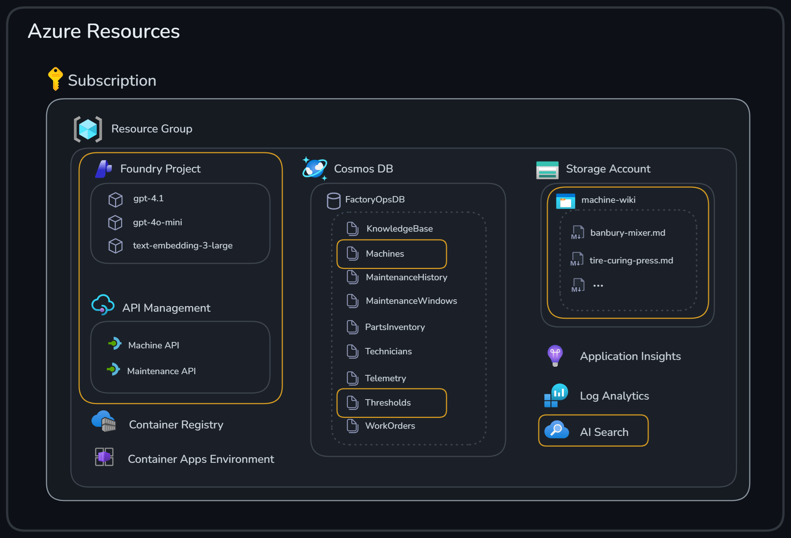
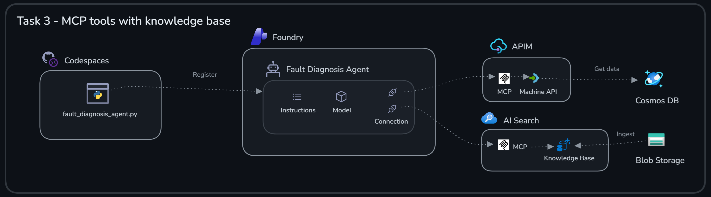

# Challenge 1: Building Agent Framework Agents for Anomaly Classification and Fault Diagnosis

Welcome to Challenge 1!

In this challenge, we will build two specialized agents for classifying and understanding machine anomalies.

**Expected duration**: 60 min

**Prerequisites**: [Challenge 0](../challenge-0/README.md) successfully completed

## 🎯 Objective

The goals for this challenge are:

- Create two **Foundry Agents** in Python
- Use MCP servers for remote tool invocation
- Learn how **Foundry IQ** can be used to ground agents with your own data

## 🧭 Context and background information


First, we’ll develop an **Anomaly Classification Agent** to interpret detected anomalies and raise corresponding maintenance alerts. Next, we’ll implement a **Fault Diagnosis Agent** to determine the root cause of an anomaly so you can prepare for maintenance. The agents will use a number of different tools to accomplish their tasks.

You will use the **Azure** resources highlighted in the image below.





### Model Context Protocol (MCP)

You will also use **Model Context Protocol (MCP)** to connect the agents with remote tools.

MCP is a standard way for an agent to discover and invoke external capabilities ("tools") through a consistent interface. 


Let's break down the key components shown in the diagram:

#### ❶ MCP Host and MCP Client

An **MCP Host** is the application that runs agents and manages MCP connections. Inside the host lives one or more **MCP Clients** that handle communication with MCP servers. Examples include:

| MCP Host | MCP Client | Description |
|----------|------------|-------------|
| **VS Code** | GitHub Copilot extension | Copilot acts as the MCP client, connecting to servers for code tools |
| **Your Python script** | Agent SDK client | The agents we build in this hack — the `MCPTool` object creates an MCP client |

#### ❷ Remote MCP Server (HTTPS)

A **remote MCP server** runs in the cloud and communicates over HTTPS. This is ideal for:
- Enterprise APIs that need to be accessed securely
- Shared services used by multiple agents
- APIs that require authentication and rate limiting

In this challenge, we expose APIs via **API Management** as remote MCP servers.

#### ❸ Tools and Data

MCP servers provide access to **tools** (actions the agent can invoke) and **data** (information the agent can retrieve). The server defines:
- Tool names and descriptions
- Input/output schemas (JSON Schema)
- The actual implementation that fetches data or performs actions

#### ❹ Local MCP Server (stdio)

A **local MCP server** runs on the same machine as the host and communicates via standard input/output (stdio). Useful for:
- Development and testing
- Tools that need local file system access
- Quick prototyping without cloud deployment

#### ❺ MCP Server Internals

Whether remote or local, every MCP server implements the same protocol:

| Component | Purpose |
|-----------|---------|
| **Discovery API** | `GET /mcp` — Returns available tools with their schemas |
| **Invocation API** | `POST /mcp/tools/{tool}` — Executes a specific tool |
| **SDKs** | Libraries in Python, TypeScript, C# to simplify building servers |

While you *could* build an MCP server yourself using an SDK, there are easier ways of doing it *without writing any code*. In the next section we'll see how **API Management** lets you expose existing APIs as MCP servers.

---


### API Management as AI Gateway

In this challenge, the tools live behind **remote MCP servers** that are hosted in **API Management** and expose API operations.

Why we use it here:

- **Decouples the agent from integrations**: the agent calls a tool by name and schema, not by hardcoding HTTP requests.
- **Reusable + portable**: the same agent code can work across environments as long as the MCP server URL/connection is configured.
- **Governance hooks**: tools can be allow-listed and can require (or skip) approval depending on your scenario.

The diagram below illustrates how API Management serves as an AI Gateway, bridging traditional API patterns with the new requirements of agentic applications:


Let's break down what the diagram shows:

| # | Component | Description |
|---|-----------|-------------|
| **❶** | **Traditional Application** | APIs have been used for many years to integrate applications with remote systems. This is the foundation we build upon. |
| **❷** | **API Proxy (APIM)** | API Management is a mature platform that shields backend systems and adds quality-of-service capabilities such as **throttling**, **security**, and **caching**. |
| **❸** | **Traditional Backend APIs** | Backend services exposed via REST, SOAP, GraphQL, and other protocols that your applications consume. |
| **❹** | **Agentic Application** | We leverage APIs just like traditional applications to build the full solution. However, agentic applications introduce new requirements around AI model integration and tool discovery. |
| **❺** | **AI APIs** | Model APIs where APIM policies enable **token limiting**, **token metrics emission**, **model load balancing**, and **content safety** — all using built-in APIM functionality applied in new ways for AI workloads. |
| **❻** | **MCP in APIM** | A standard API can easily be exposed in APIM as an **MCP server without writing any code**. This is exactly what we will do in this exercise — turning existing APIs into tools that agents can discover and invoke.


### Grounding with Foundry IQ

You will also ground the agent with data using **Foundry IQ**.

**Foundry IQ** is a managed knowledge base (an agentic retrieval workload powered by **Azure AI Search**) that lets your agent retrieve relevant chunks from your own documents at runtime. Instead of pasting wiki content into prompts, the agent issues targeted retrieval requests and uses the returned passages to produce answers that stay aligned with your source material.

In this challenge, we’ll use Foundry IQ to make the **machine wiki** available to the Fault Diagnosis Agent via an MCP tool.


## ✅ Tasks

### Task 1: Create and test initial Anomaly Classification Agent

As a first step, we will create an agent to interpret and classify anomalies and raise maintenance alerts if certain thresholds have been violated. The agent will take anomalies for specific machines as input and check them against thresholds for that machine type by using JSON data stored in **Cosmos DB**.

---

#### Task 1.1. Review initial code for Anomaly Classification Agent

Examine the Python code in [anomaly_classification_agent.py](./agents/anomaly_classification_agent.py)  
A few things to observe:

- The agent uses two function tools
  - `get_thresholds`: Retrieves specific metric threshold values for certain machine types.
  - `get_machine_data`: Fetches details about machines such as id, model and maintenance history.
- The agent is instructed to output both structured alert data in a specific format and a human readable summary.
- The code will create the agent and run a sample query against it.

---

#### Task 1.2. Run the code

```bash
cd challenge-1
python agents/anomaly_classification_agent.py

```

Verify that the agent responded with a reasonable answer.

<details> 
<summary>You should see an output similar to this:</summary>

```bash
✅ Created Anomaly Classification Agent: fc0eed0f-923e-4be7-8a28-916f8b85ed79

🧪 Testing the agent with a sample query...
✅ Agent response: {
  "status": "medium",
  "alerts": [
    {
      "name": "curing_temperature",
      "severity": "warning",
      "description": "curing_temperature value of 179.2°C exceeds warning threshold of 178°C."
    },
    {
      "name": "cycle_time",
      "severity": "warning",
      "description": "cycle_time value of 14.5 minutes exceeds warning threshold of 14 minutes."
    }
  ],
  "summary": {
    "totalRecordsProcessed": 2,
    "violations": { "critical": 0, "warning": 2 }
  }
}

Summary:
Both anomalies for machine-001 indicate warning-level threshold violations:
- The curing_temperature (179.2°C) is above the warning threshold, which could affect tire quality.
- The cycle_time (14.5 min) is also above its warning threshold, indicating curing process deviation.
Immediate maintenance review is recommended to prevent escalation to critical levels.

```

</details>

---

### Task 2: Equip the agent with MCP tools

Machine and threshold information is typically stored in a central system and exposed through an API. Let's adjust the data access to use an existing Machine and Maintenance APIs instead of accessing a **Cosmos DB** database directly. In this step you will expose the Machine and Maintenance APIs as **Model Context Protocol (MCP)** servers for convenient access from the Agent.

---

#### Task 2.1. Test the Machine API

The Machine API and Maintenance API are already available in **API Management** and contain endpoints for getting details about a specific machine and thresholds for certain machine types. Try the APIs using the following commands:

```bash
# Get all machines
curl -fsSL "$APIM_GATEWAY_URL/machine" -H "Ocp-Apim-Subscription-Key: $APIM_SUBSCRIPTION_KEY" -H "Accept: application/json"

# Get a specific machine
curl -fsSL "$APIM_GATEWAY_URL/machine/machine-001" -H "Ocp-Apim-Subscription-Key: $APIM_SUBSCRIPTION_KEY" -H "Accept: application/json"

# Get thresholds for a machine type 
curl -fsSL "$APIM_GATEWAY_URL/maintenance/tire_curing_press" -H "Ocp-Apim-Subscription-Key: $APIM_SUBSCRIPTION_KEY" -H "Accept: application/json"
```

---

#### Task 2.2. Expose APIs as MCP servers

**API Management** provides an easy way to expose APIs as MCP servers without writing any additional wrapper code.

1. Navigate to your **API Management** instance in the [Azure portal](https://portal.azure.com).
2. Choose *APIs* and notice that *Machine API* and *Maintenance API* you tested earlier is available


3. Navigate to the *MCP Servers* section
4. Click *Create MCP Server* and *Expose an API as MCP Server*
5. Select API, operations and provide the following details
    - **API**: *Machine API*
    - **API Operations**: *Get Machine*
    - **Display Name**: *Get Machine Data*
    - **Name**: `get-machine-data`
    - **Description**: *Gets details about a specific machine*


6. Click *Create*
7. Finally, save the *MCP Server URL* of the newly created MCP server, you will need it in the next part. Add a new entry with the value in the `.env` file `MACHINE_MCP_SERVER_ENDPOINT="<MCP_SERVER_URL>"`

Perform the same steps to create the *Maintenance* MCP server using the following settings:

- **API**: *Maintenance API*
- **API Operations**: *Get Threshold*
- **Display Name**: *Get Maintenance Data*
- **Name**: `get-maintenance-data`
- **Description**: *Gets maintenance data such as thresholds for maintenance alerts*

Save the *MCP Server URL* of the MCP server as `MAINTENANCE_MCP_SERVER_ENDPOINT="<MCP_SERVER_URL>"`

Reload the environment variables from file to make the new environment variables available in the shell

```bash
export $(cat ../.env | xargs)
```

---

#### Task 2.3. Use the MCP Servers from the agent

Now it's time to replace the direct database access with our new *Machine* and *Maintenance* MCP Servers. The MCP servers will be added as tools to the **Anomaly Classification Agent**.

Examine the Python code in [anomaly_classification_agent_mcp.py](./agents/anomaly_classification_agent_mcp.py)  
A few things to observe:

- The agent uses two MCP tools
  - `machine-data`: Fetches details about machines such as id, model and maintenance history.
  - `maintenance-data`: Retrieves specific metric threshold values for certain machine types.
- A project connection is created for the MCP tools

---

#### Task 2.4. Test the agent with MCP tool

Run the code

```bash
python agents/anomaly_classification_agent_mcp.py

```

Verify that the agent responed with a correct answer.

<details> 
<summary>You should see an output similar to this:</summary>

```bash
✅ Connection 'machine-data-connection' created successfully.
✅ Connection 'maintenance-data-connection' created successfully.
✅ Created Anomaly Classification Agent: AnomalyClassificationAgent:2

🧪 Testing the agent with a sample query...
✅ Agent response: {
  "status": "medium",
  "alerts": [
    {
      "name": "curing_temperature",
      "severity": "warning",
      "description": "curing_temperature exceeded warning threshold with value 179.2°C; warning threshold is 178°C."
    }
  ],
  "summary": {
    "totalRecordsProcessed": 2,
    "violations": {
      "critical": 0,
      "warning": 1
    }
  }
}

Summary:
Out of 2 anomaly records reviewed for machine-001 (Tire Curing Press A1), one violation was found. The curing_temperature metric exceeded the warning threshold (value: 179.2°C, threshold: 178°C), which may affect tire quality. No critical alerts were detected. Cycle time did not have available threshold data and was not evaluated for violations. Maintenance attention is advised for the elevated curing temperature.

```

</details>

---

#### Task 2.5. Review and test the agent in Foundry Portal

1. Navigate to [**Microsoft Foundry Portal**](https://ai.azure.com).

> [!TIP]
> Make sure you are using the new Foundry portal experience.  
> You might need to enable it using the toggle in the upper right corner.
>
> 
>

1. Select the *Build* tab to list available agents


2. Examine the configuration details for `AnomalyClassificationAgent` you just created.
<br/>


<br/>

> [!NOTE]
> There are two vesions of **Anomaly Classifcation Agent** created, one for the inital agent with local tools and one for the version that uses MCP tools


3. Select the **Anomaly Classification Agent** and try out some additional questions in the playground:

- Normal condition (no maintenance needed). Use query `Hello, can you classify the following metric for machine-002: [{"metric": "drum_vibration", "value": 2.1}]`


- Critical anomaly. Use query `Hello, can you classify the following metric for machine-005: [{"metric": "mixing_temperature", "value": 175}]`

---

### Task 3: Understand root cause with Fault Diagnosis Agent and Foundry IQ

The next agent we'll create, **Fault Diagnosis Agent**, is tasked to understand the actual root cause of the issues alerted from the **Anomaly Classification Agent**. Besides machine data and maintenance history we'll add a machine wiki as a tool for the agent by leveraging **Foundry IQ**.

#### Task 3.1. Examine the machine data wiki

The machine wiki contains knowledge (common issues, repair instructions and repair details) about different machine types. The wiki pages are available as markdown files in **Azure Blob Storage**. Take a moment to review the content:

1. Navigate to [**Azure portal**](https://portal.azure.com) and locate the storage account.
2. Select *Storage browser* / *Blob containers* and select the `machine-wiki` container  
3. Select a wiki article and select the *Edit* tab to preview the content


---

#### Task 3.2. Expose the machine wiki data as a knowledge base

**Foundry IQ** consists of knowledge sources (*what* to retrieve) and knowledge bases (*how* to retrieve). Knowledge sources are created as standalone objects and then referenced in a knowledge base.

> [!NOTE]
> [**Foundry Agent Service**](https://learn.microsoft.com/en-us/azure/ai-foundry/agents/overview?view=foundry) orchestrates calls to the knowledge base via the MCP tool and synthesizes the final answer. At runtime, the agent calls only the knowledge base, not the data platform (such as **Azure Blob Storage** in our case) that underlies the knowledge source. The knowledge base handles all retrieval operations.

Create a knowledge source and knowledge base by following the steps in the [create_knowledge_base.ipynb](./create_knowledge_base.ipynb) notebook.

> [!TIP]
> When running the notebook you will be asked to select an environment. Pick the Pyton 3.11.x environment`
>
> 
>

---

#### Task 3.3. Create the Fault Diagnosis Agent

Let's create the **Fault Diagnosis Agent** and use our newly created **Foundry IQ** knowledge base.

Examine the Python code in [fault_diagnosis_agent.py](./agents/fault_diagnosis_agent.py)  

Currently only one tool `machine_data` is available. Your task is to add the knowledge base MCP tool to the agent so the machine wiki content can be used when diagnosing the root cause of the anomaly.

1. Locate placeholder comment `# TODO: add Foundry IQ MCP tool`  in [fault_diagnosis_agent.py](./agents/fault_diagnosis_agent.py)
2. Add the knowledge base as an `MCPTool` by updating the placeholder with the following code

    ```python
    MCPTool(
        server_label="machine-wiki",
        server_url=machine_wiki_mcp_endpoint,
        require_approval="never",
        project_connection_id="machine-wiki-connection"
    )
    ```

A few things to observe:

- The agent now uses two MCP tools
  - `knowledge_base`: Retrieves machine wiki information for root cause analysis.
  - `machine_data`: Fetches details about machines such as id, model and maintenance history.
- The agent is clearly instructed to use our machine knowledge base instead of its own knowledge.

Run the code:

```bash
python agents/fault_diagnosis_agent.py 
```

Verify the answer from the agent.
<details> 
<summary>You should see an output similar to this:</summary>

```bash
✅ Agent response: {
    "MachineId": "machine-001",
    "FaultType": "curing_temperature_excessive",
    "RootCause": "Heating element malfunction",
    "Severity": "High",
    "DetectedAt": "2024-06-14T00:00:00Z",
    "Metadata": {
        "MostLikelyRootCauses": [
            "Heating element malfunction",
            "Temperature sensor drift",
            "Steam pressure set too high",
            "Thermostat failure",
            "Inadequate cooling water flow"
        ],
        "ObservedCuringTemperature": 179.2,
        "ThresholdTemperature": 178,
        "machineType": "tire_curing_press",
        "maintenanceHistory": [
            {
                "date": "2024-11-01",
                "type": "preventive",
                "description": "Bladder inspection and heating element check",
                "technician": "John Smith"
            }
        ],
        "KBReference": "Tire Curing Press - Curing Temperature Excessive",
        "KBArticleId": "a19e61459ea9_aHR0cHM6Ly9tc2FndGhhY2tzYXl4bWliYnZ4dm5rZzIuYmxvYi5jb3JlLndpbmRvd3MubmV0L21hY2hpbmUtd2lraS90aXJlX2N1cmluZ19wcmVzcy5tZA2_pages_0"
    }
}
```

</details>
<br/>

🎉 Congratulations! You've successfully built two agents and equipped them with enterprise tools to perform their tasks.

## 🚀 Go Further

> [!NOTE]
> Finished early? These tasks are **optional** extras for exploration. Feel free to move on to the next challenge — you can always come back later!

### Experiment with prompts

Try modifying the system instructions in [anomaly_classification_agent_mcp.py](./agents/anomaly_classification_agent_mcp.py) or [fault_diagnosis_agent.py](./agents/fault_diagnosis_agent.py). Observe how different phrasings affect the agent's responses — this is practical prompt engineering in action.

### Test edge cases in the playground

Use the **Foundry Portal** playground to test boundary conditions:
- Non-existent machines (e.g., `machine-999`)
- Metrics at exact threshold values
- Invalid or malformed input data
- Multiple anomalies at once

### Add a new wiki article

1. Create a new markdown file for a machine type (e.g., copy and modify an existing article)
2. Upload it to the `machine-wiki` container in **Azure Blob Storage**
3. Re-run the indexer to include the new content
4. Test retrieval with the **Fault Diagnosis Agent**

## 🛠️ Troubleshooting and FAQ

<details>
<summary>Problem: the agent doesn't show up in the new <b>Foundry Portal</b></summary>
There can be a certain delay before newly created agents are visible in the **Foundry Portal**. If you don't see the agent after 10 minutes, try refreshing the browser or run the Python script again.
</details>

<details>
<summary>Problem: <code>PermissionDenied</code> denied when running agent creation Python scripts</summary>
Make sure you have assigned yourself the *AI Developer* role on the **Foundry Project**.
</details>


## 🧠 Conclusion and reflection
Let’s quickly recap what we did.

In [Task 1](#task-1-create-and-test-initial-anomaly-classification-agent) we created the **Anomaly Classification Agent** using a Python script.


The agent had a system prompt with instructions how to behave and had two *local* tools to be able to query **Cosmos DB** data. When running the Python script the tools executed locally in the Python process. If you were to ask the same questions in the **Foundry Portal** playground the agent wouldn't be able to answer since the tools are not available there.

> [!NOTE]
> **When do you need an agent?** This particular example could be solved *without* an agent — it's mainly mapping metrics to thresholds. The only thing we're using AI for here is generating a human-readable summary of the issue. However, using an agent (besides being a learning exercise) means we can add more tools in the future for more advanced reasoning. We also get built-in observability and memory (conversation history), which we'll examine in Challenge 3.
>
> You don't always need a full agent. You can use the **Azure AI Inference SDK** to call a model directly without going through an agent when your use case is simpler.


In [Task 2](#task-2-equip-the-agent-with-mcp-tools), we published the APIs as MCP servers in **API Management** and connected them to the Foundry project.


The **Anomaly Classification Agent** could then run fully in **Agent Service**, so the questions asked in the **Foundry Playground** worked.

Finally, in [Task 3](#task-3-understand-root-cause-with-fault-diagnosis-agent-and-foundry-iq) we created the **Fault Diagnosis Agent** and grounded with data via **AI Search** exposed as an MCP server.



This agent also runs fully in **Agent Service** and can use the tools when answering questions in the playground. Note that the content from **Blob Storage** isn't fetched on demand — instead, it's indexed ahead of time, and retrieval queries are executed against **AI Search**.

If you want to expand your knowledge on what we’ve covered in this challenge, have a look at the content below:

- [Connect to **Model Context Protocol** servers](https://learn.microsoft.com/en-us/azure/ai-foundry/agents/how-to/tools/model-context-protocol?view=foundry&pivots=python)
- [Create a knowledge base in **Azure AI Search**](https://learn.microsoft.com/en-us/azure/search/agentic-retrieval-how-to-create-knowledge-base?tabs=rbac&pivots=python)
- [What is a knowledge source?](https://learn.microsoft.com/en-us/azure/search/agentic-knowledge-source-overview)
- [Connect a **Foundry IQ** knowledge base to **Foundry Agent Service**](https://learn.microsoft.com/en-us/azure/ai-foundry/agents/how-to/tools/knowledge-retrieval?view=foundry&tabs=foundry%2Cpython)
- [Azure AI Inference client library for Python](https://learn.microsoft.com/en-us/python/api/overview/azure/ai-inference-readme?view=azure-python-preview)

---

**Next step:** [Challenge 2](../challenge-2/README.md) - Building the **Repair Planner Agent** with **GitHub Copilot**
