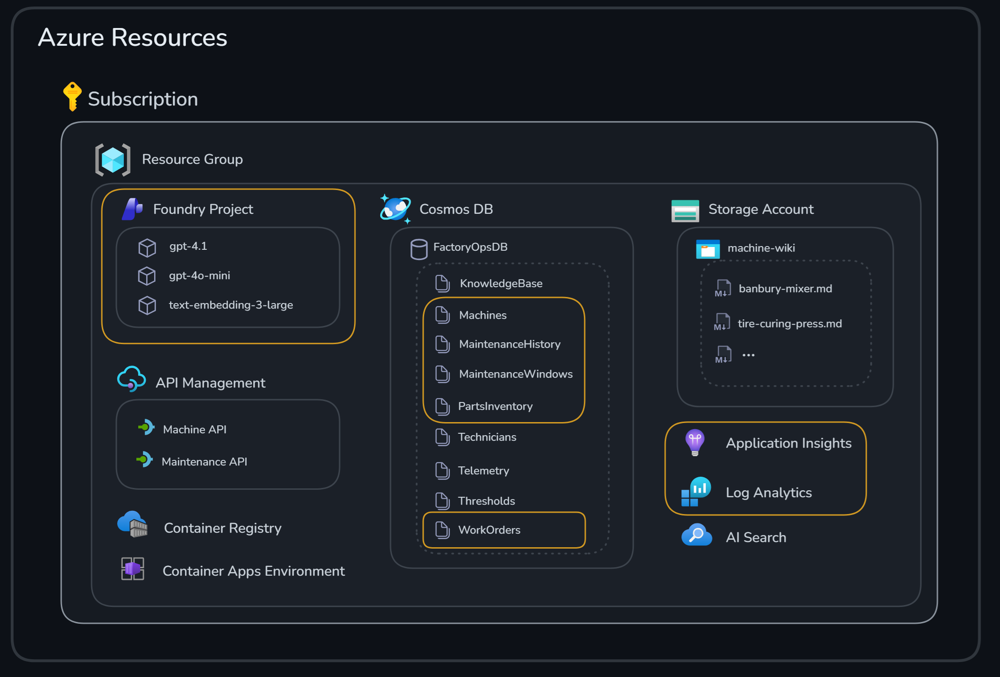

# Challenge 3: Maintenance Scheduler & Parts Ordering Agents

Welcome to Challenge 3!

In this challenge, you'll work with two specialized AI agents that optimize factory operations through intelligent maintenance scheduling and automated supply chain management.

**Expected Duration:** 30 minutes

**Prerequisites**: [Challenge 0](../challenge-0/challenge-0.md) successfully completed

## 🎯 Objective

The goals for this challenge are:

- Create two **Foundry** agents using Python
- Use agent memory
- Examine agent observability


## 🧭 Context and Background


The **Maintenance Scheduler Agent** analyzes work orders and historical maintenance data to find optimal maintenance windows that minimize production disruption.
The **Parts Ordering Agent** checks inventory levels for required parts, evaluates supplier performance and lead times, and generates optimized parts orders with cost analysis.

You will use the Azure resources highlighted in the image below.




Both agents interact with **Cosmos DB** as their primary data store.

<details>
<summary>Containers Used</summary>

| Container | Purpose | Agent Usage |
|-----------|---------|-------------|
| `WorkOrders` | Work orders from Repair Planner | Read by both agents to get job details |
| `Machines` | Equipment information | Referenced for machine context |
| `MaintenanceHistory` | Historical maintenance records | Read by **Maintenance Scheduler Agent** for pattern analysis |
| `MaintenanceWindows` | Available production windows | Read by **Maintenance Scheduler Agent** to find optimal timing |
| `MaintenanceSchedules` | Generated maintenance schedules | Written by **Maintenance Scheduler Agent** |
| `PartsInventory` | Current stock levels | Read by **Parts Ordering Agent** to check availability |
| `Suppliers` | Supplier information | Read by **Parts Ordering Agent** for sourcing decisions |
| `PartsOrders` | Generated parts orders | Written by **Parts Ordering Agent** |

</details>

<details>
<summary>Data Flow</summary>

```
┌─────────────────────────────────────────────────────────────────────────────┐
│                        MAINTENANCE SCHEDULER AGENT                          │
└─────────────────────────────────────────────────────────────────────────────┘

Input (READ):                         Output (WRITE):
├─ WorkOrders                         ├─ MaintenanceSchedules
├─ MaintenanceHistory                 │  └─ scheduled_date
├─ MaintenanceWindows                 │  └─ risk_score (0-100)
└─ Machines                            │  └─ predicted_failure_probability
                                      │  └─ recommended_action
                                      │  └─ maintenance_window
                                      │  └─ reasoning
                                      └─ WorkOrders (status update to 'Scheduled')

┌─────────────────────────────────────────────────────────────────────────────┐
│                          PARTS ORDERING AGENT                               │
└─────────────────────────────────────────────────────────────────────────────┘

Input (READ):                         Output (WRITE):
├─ WorkOrders                         ├─ PartsOrders
├─ PartsInventory                     │  └─ supplier_id, supplier_name
├─ Suppliers                          │  └─ order_items (part, qty, cost)
└─ Machines                            │  └─ total_cost
                                      │  └─ expected_delivery_date
                                      │  └─ reasoning
                                      └─ WorkOrders (status update to 'PartsOrdered' or 'Ready')
```

</details>

---

### Agent Memory

Both agents implement **persistent memory** by storing conversation history in **Cosmos DB**. This enables agents to maintain context across multiple interactions with the same entity (machine or work order).

**Why use agent memory?**
- **Contextual awareness**: Agents can reference previous interactions when making decisions, leading to more informed recommendations
- **Consistency**: Maintains a coherent conversation thread even when sessions are interrupted or resumed later
- **Learning from history**: The AI can consider past recommendations and outcomes when generating new responses

The conversation history is injected into the AI prompt as context, so the model can see what was previously discussed and provide more relevant responses.

---

### Azure AI Tracing & Observability

Both agents are instrumented for **end-to-end observability** so you can debug runs and understand model behavior without adding print statements everywhere.

**What's included:**
- ✅ **Azure Monitor Integration** - Sends traces to **Application Insights**
- ✅ **AI Inference Instrumentation** - Automatically traces all AI model calls
- ✅ **OpenTelemetry Support** - Industry-standard distributed tracing
- ✅ **Graceful Fallback** - Agents work even if tracing packages aren't installed

**What you get in traces:**
- **Agent execution timeline**: each step (read data, reason, write results)
- **AI model calls**: prompts, responses, token usage, and latency (when enabled)
- **Cosmos DB operations**: reads/writes to containers used by the agents
- **Failures with context**: exceptions + which step failed

**How it works:**

Tracing is automatically enabled when you run the agents if:
1. Tracing packages are installed (already included in `requirements.txt`)
2. `APPLICATIONINSIGHTS_CONNECTION_STRING` environment variable is set (configured in `.env`)

The agents use **Azure Monitor** exporters to send traces, metrics, and logs directly to **Application Insights**, which integrates with **Azure AI Foundry** portal.

<details>
<summary>Tracing dependencies (already installed)</summary>

The following packages are included in `requirements.txt`:
- `azure-ai-inference[tracing]` - AI tracing instrumentation
- `azure-monitor-opentelemetry` - **Azure Monitor** exporter
- `opentelemetry-api` and `opentelemetry-sdk` - OpenTelemetry framework
- `opentelemetry-exporter-otlp-proto-grpc` - gRPC exporter for OpenTelemetry

</details>

## ✅ Tasks

### Task 1: Maintenance Scheduler Agent

The **Maintenance Scheduler Agent** analyzes work orders and determines the optimal time to perform maintenance by balancing equipment reliability needs against production impact.

**Agent memory in action:** This agent stores chat history per machine using `get_machine_chat_history` and `save_machine_chat_history`. When the agent runs for the same machine multiple times, it can recall previous maintenance discussions and recommendations, allowing it to build on prior analysis rather than starting fresh each time.

What it does

1. **Reads Work Order** from `WorkOrders` container
2. **Analyzes Historical Data** from `MaintenanceHistory` container to understand failure patterns
3. **Checks Available Windows** from `MaintenanceWindows` container to find low-impact periods
4. **Runs AI Analysis** using **Microsoft Agent Framework** to assess risk and recommend timing
5. **Saves Schedule** to `MaintenanceSchedules` container with risk scores and recommendations
6. **Updates Work Order** status to 'Scheduled'

---

#### Task 1.1 Run the Agent

```bash
# # Ensure you are located in the challenge-3 directory
cd challenge-3

python agents/maintenance_scheduler_agent.py wo-2024-456
```

<details>
<summary>You should see an output similar to this:</summary>

```text
📊 Agent Framework tracing enabled (Azure Monitor)
   Traces sent to: InstrumentationKey=05a5a2ca-aa92-4118-ba1a-c7086eca58c9
   View in Azure AI Foundry portal: https://ai.azure.com -> Your Project -> Tracing

   Checking existing agent versions in portal...
   Found 0 existing versions
   Creating new version (will be version #1)...
   Registering MaintenanceSchedulerAgent in Azure AI Foundry portal...
   ✅ New version created!
      Agent ID: MaintenanceSchedulerAgent:1
   Verifying creation...
   Total versions now in portal: 1
   Check portal at: https://ai.azure.com

1. Retrieving work order...
   ✓ Work Order: wo-2024-456
   Machine: machine-004
   Fault: 
   Priority: high

2. Analyzing historical maintenance data...
   ✓ Found 2 historical maintenance records

3. Checking available maintenance windows...
   ✓ Found 14 available windows in next 14 days

4. Running AI predictive analysis...
   Using persistent chat history for machine: machine-004
   ✅ Using agent: 60d02159-de4a-4dd2-a39c-33191aa2ea25
   ✓ Analysis complete!

=== Predictive Maintenance Schedule ===
Schedule ID: sched-1769021150.421991
Machine: machine-004
Scheduled Date: 2026-01-22 22:00
Window: 22:00 - 06:00
Production Impact: Low
Risk Score: 82/100
Failure Probability: 67.0%
Recommended Action: URGENT

Reasoning:
The work order is marked as high priority, indicating either a critical fault or a high risk of operational impact. The time since last maintenance is a little over a month, which is relatively short compared to typical MTBF (Mean Time Between Failures), but historical maintenance events on this machine (spindle bearing failure and load cell calibration drift) have resulted in substantial downtime and cost. While there are no previous occurrences of the specific fault type, the combination of high priority, recent significant failures, and the overall criticality of the equipment elevates risk. The selected window (first available, low production impact) ensures downtime cost is minimized while addressing the issue with urgency, but not immediate action, as the probability of catastrophic failure is moderate. Scheduling at the first available low-impact window balances risk mitigation with operational efficiency.

5. Saving maintenance schedule...
   ✓ Schedule saved to **Cosmos DB**

6. Updating work order status...
   ✓ Work order status updated to 'Scheduled'

✓ Predictive Maintenance Agent completed successfully!
```
</details>

---

### Task 2: Run Parts Ordering Agent

The **Parts Ordering Agent** checks inventory availability and generates optimized parts orders by evaluating supplier reliability, lead times, and costs.

**Agent memory in action:** This agent stores chat history per work order using `get_work_order_chat_history` and `save_work_order_chat_history`. This allows the agent to maintain ordering context for each job - if a work order is processed multiple times (e.g., due to partial fulfillment or changes), the agent remembers previous ordering decisions and can provide consistent recommendations.

What it does

1. **Reads Work Order** from `WorkOrders` container to get required parts
2. **Checks Inventory** from `PartsInventory` container to determine what's in stock
3. **Identifies Missing Parts** that need to be ordered
4. **Finds Suppliers** from `Suppliers` container that can provide the parts
5. **Runs AI Analysis** to optimize supplier selection based on reliability, lead time, and cost
6. **Saves Parts Order** to `PartsOrders` container with order details
7. **Updates Work Order** status to 'PartsOrdered' (or 'Ready' if all parts available)

#### Task 2.1: Run the Agent

```bash
python agents/parts_ordering_agent.py wo-2024-456
```

<details>
<summary>Example output (parts need ordering)</summary>

```text
 Agent Framework tracing enabled (Azure Monitor)
   Traces sent to: InstrumentationKey=05a5a2ca-aa92-4118-ba1a-c7086eca58c9
   View in Azure AI Foundry portal: https://ai.azure.com -> Your Project -> Tracing

   Checking existing agent versions in portal...
   Found 0 existing versions
   Creating new version (will be version #1)...
   Registering PartsOrderingAgent in Azure AI Foundry portal...
   ✅ New version created!
      Agent ID: PartsOrderingAgent:1
   Verifying creation...
   Total versions now in portal: 1
   Check portal at: https://ai.azure.com

1. Retrieving work order...
   ✓ Work Order: wo-2024-456
   Machine: machine-004
   Required Parts: 2
   Priority: high

2. Checking inventory status...
   ✓ Found 2 inventory records

⚠️  2 part(s) need to be ordered:
   - Load Cell 2kN (Qty: 1)
   - Rotary Encoder 5000ppr (Qty: 1)

3. Finding suppliers...
   ✓ Found 2 potential suppliers

4. Running AI parts ordering analysis...
   Using persistent chat history for work order: wo-2024-456
   ✓ Parts order generated!

=== Parts Order ===
Order ID: PO-58689c01
Work Order: wo-2024-456
Supplier: Industrial Parts Co (ID: SUP-001)
Expected Delivery: 2024-06-17
Total Cost: $505.00
Status: Pending

Order Items:
  - Load Cell 2kN (#TUM-LC-2KN)
    Qty: 1 @ $320.00 = $320.00
  - Rotary Encoder 5000ppr (#TUM-ENC-5000)
    Qty: 1 @ $185.00 = $185.00

5. Saving parts order...
   ✓ Order saved to SCM system

6. Updating work order status...
   ✓ Work order status updated to 'PartsOrdered'
```

</details>

<br/>
Test with another work order

```bash
python agents/parts_ordering_agent.py wo-2024-468
```

<details>
<summary>Example output (parts are available)</summary>

```text
=== Parts Ordering Agent ===

📊 Agent Framework tracing enabled (Azure Monitor)
   Traces sent to: InstrumentationKey=05a5a2ca-aa92-4118-ba1a-c7086eca58c9
   View in Azure AI Foundry portal: https://ai.azure.com -> Your Project -> Tracing

   Checking existing agent versions in portal...
   Found 1 existing versions
   Creating new version (will be version #2)...
   Registering PartsOrderingAgent in Azure AI Foundry portal...
   ✅ New version created!
      Agent ID: PartsOrderingAgent:2
   Verifying creation...
   Total versions now in portal: 2
   Check portal at: https://ai.azure.com

1. Retrieving work order...
   ✓ Work Order: wo-2024-468
   Machine: machine-005
   Required Parts: 2
   Priority: medium

2. Checking inventory status...
   ✓ Found 2 inventory records

✓ All required parts are available in stock!
No parts order needed.

3. Updating work order status...
   ✓ Work order status updated to 'Ready'

✓ Parts Ordering Agent completed successfully!
```

</details>


---

### Task 3: Azure AI Tracing & Observability

This challenge uses **Azure AI Foundry** tracing so you can inspect runs in the portal.

**Why observability matters:** When running agents in production, you need visibility into what's happening. The batch script processes 5 work orders through both agents, generating 10 total agent runs. By examining the traces, you can:
- **Identify bottlenecks**: See which steps take the longest (AI inference vs. database operations)
- **Debug failures**: When an agent fails, traces show exactly which step failed and why
- **Monitor costs**: Token usage metrics help you understand and optimize AI spending
- **Validate behavior**: Confirm that agents are making reasonable decisions by reviewing their reasoning

#### Task 3.1: Generate traces
Generate some trace data by running a batch script [run-batch.py](./run-batch.py) which will process 5 work orders through each agent.

```bash
python run-batch.py
```

#### Task 3.2: View traces in Azure AI Foundry

1. Go to <https://ai.azure.com>
2. Select your project
3. Select *Agents* and then `MaintenanceSchedulerAgent` or `PartsOrderingAgent`
4. Go to the *Monitor* tab

You should see someting similar to this


You can examine metrics for *Token usage*, *Agent runs*, *Tool calls*, and potential *Errors*.


#### Task 3.3: View traces in Application Insights

The **Foundry Project** is connected to **Application Insights** where the monitoring data is stored.
Select *Open in Azure Monitor* in the upper right corner.


This will open **Application Insights** where you will see similar monitoring details as in the **Foundry** portal, but you can also drill further into traces for troubleshooting purposes.


🎉 Congratulations! You've successfully worked with two agents that integrate with **Cosmos DB** and include production-ready observability.


## 🚀 Go Further

> [!NOTE]
> Finished early? These tasks are **optional** extras for exploration. Feel free to move on to the next challenge — you can always come back later!

### Customize the scheduling logic

Modify the **Maintenance Scheduler Agent** prompt in `maintenance_scheduler_agent.py` to adjust how it calculates risk scores. Try:
- Weighting recent failures more heavily than older ones
- Adding urgency modifiers based on machine criticality
- Incorporating seasonal production patterns (e.g., higher thresholds during peak periods)

### Add supplier scoring

Enhance the **Parts Ordering Agent** to track supplier performance over time:
- Add a `reliability_score` field to supplier records
- Update scores based on on-time delivery rates
- Factor historical performance into supplier selection

### Create custom Kusto queries

Write custom queries in **Application Insights** to analyze agent behavior:
- Calculate average response time per agent
- Identify which work orders trigger the longest AI inference times
- Track token usage trends over time
- Alert on agents that exceed cost thresholds

### Implement memory expiration

The current agent memory stores all conversation history indefinitely. Add logic to:
- Expire conversations older than 30 days
- Summarize old conversations instead of keeping full history
- Limit memory to the most recent N interactions per entity

### Test failure scenarios

Explore how the agents handle edge cases:
- Work orders with no available maintenance windows
- Parts that no supplier can provide
- Machines with no maintenance history
- Extremely high-priority orders that need immediate scheduling


## 🛠️ Troubleshooting and FAQ

<details>
<summary>Problem: I don't see my traces in Azure AI Foundry portal</summary>

There can be a delay of **2-5 minutes** before metrics and traces appear in the **Azure AI Foundry** portal. This is normal behavior as data is batched and processed before being displayed.

**What to do:**
1. Wait a few minutes and refresh the portal
2. Check **Application Insights** directly - traces often appear there faster
   - Go to your **Application Insights** resource in the **Azure** portal
   - Navigate to *Transaction search* or *Logs* to query traces immediately
3. Verify your `APPLICATIONINSIGHTS_CONNECTION_STRING` is correctly set in `.env`

</details>

## 🧠 Conclusion

Let’s quickly recap what we did.

In [Task 1](#task-1-maintenance-scheduler-agent) we created the **Maintenance Scheduler Agent** to analyze work orders, look at historical maintenance patterns, find low-impact maintenance windows, and then save a schedule back to **Cosmos DB**. The **Maintenance Scheduler Agent** stores chat history per machine (`get_machine_chat_history` / `save_machine_chat_history`), allowing it to recall previous maintenance discussions for that specific equipment. The agent is used for **predictive maintenance scheduling** - it calculates risk scores based on historical failure patterns, predicts failure probability, and recommends optimal maintenance windows (IMMEDIATE, URGENT, or SCHEDULED) to minimize production disruption while addressing equipment reliability needs.


In [Task 2](#task-2-run-parts-ordering-agent) we created the **Parts Ordering Agent** to check required parts, validate what's already in inventory, select an optimized supplier plan, and write a parts order back to **Cosmos DB**. The **Parts Ordering Agent** stores chat history per work order (`get_work_order_chat_history` / `save_work_order_chat_history`), maintaining ordering context for each job. The agent is used for **automated parts procurement** - it evaluates suppliers based on reliability, lead time, and cost to generate optimized purchase orders with expected delivery dates and total cost calculations.


Finally, in [Task 3](#task-3-azure-ai-tracing--observability) we used **Azure AI Foundry tracing** to observe the end-to-end workflow, including data access and model calls. This is useful for **production monitoring and debugging** - identifying performance bottlenecks, tracking token usage and costs, debugging failures with full context, and validating that agents are making reasonable decisions by reviewing their reasoning in the traces.


If you want to expand your knowledge on what we’ve covered in this challenge, have a look at the content below:

- [Azure AI Foundry Tracing Documentation](https://learn.microsoft.com/azure/ai-foundry/how-to/develop/trace-agents-sdk)
- [Application Insights Overview](https://learn.microsoft.com/azure/azure-monitor/app/app-insights-overview)
- [Microsoft Agent Framework Documentation](https://learn.microsoft.com/azure/ai-foundry/how-to/develop/agent-framework)
- [Cosmos DB Best Practices](https://learn.microsoft.com/azure/cosmos-db/nosql/best-practice-dotnet)

---
**Next step:** [Challenge 4](../challenge-4/README.md) - Multi-Agent Orchestration
